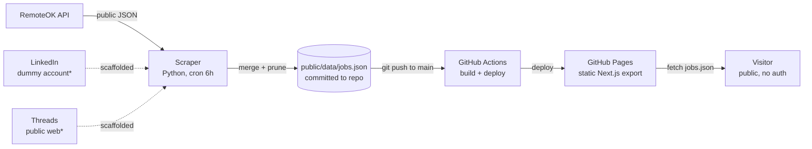

# 03 — System Architecture

| Field | Value |
|---|---|
| Version | 0.2 |
| Owner | Muhammad Fauzi Azhar |
| Status | Approved |

> **v0.2 pivot:** dropped the Postgres + Next.js dynamic + Vercel design in favor
> of a fully static site (Next.js export on GitHub Pages) with a JSON data file
> produced by a Python scraper. Sources narrowed to RemoteOK (live) plus LinkedIn
> and Threads (scaffolded). The ATS sources are intentionally left to
> [Feashliaa/job-board-aggregator](https://github.com/Feashliaa/job-board-aggregator).

---

## 1. Overview

Job Aggregator is a **static site with a scheduled scraper**. There is no
backend server and no database. A Python scraper runs on a GitHub Actions cron,
writes a single JSON file (`public/data/jobs.json`) into the repo, and a Next.js
static export served from GitHub Pages reads that file in the browser. All
filtering and search happen client-side.

Core principles:

1. **No backend.** Static export + a committed JSON file is enough for a job
   board of this size. Free to host, trivial to fork and self-host.
2. **Don't duplicate Feashliaa.** Skip the ATS platforms it already covers;
   focus on RemoteOK, LinkedIn, Threads.
3. **One schema, many sources.** All sources normalize into one `Job` shape
   (`src/types/job.ts`), validated with Zod when loaded.
4. **Idempotent scrapes.** The runner loads the existing file, upserts by
   `id = "{source}-{externalId}"`, prunes entries older than 30 days, rewrites.
5. **No login, no cookies.** The site is fully public and stateless.

---

## 2. Context Diagram



`*` LinkedIn and Threads are scaffolded no-ops until implemented (US-15, US-16).

---

## 3. Module Boundaries

```
job-aggregator/
├── scrapers/                  # Python 3.12
│   ├── common/                # http, models (camelCase JSON), normalize,
│   │                          #   classify (tier + tech), store (merge/prune/write)
│   ├── sources/
│   │   ├── remoteok.py        # live
│   │   ├── linkedin.py        # scaffold (US-15)
│   │   └── threads.py         # scaffold (US-16)
│   ├── runner.py              # CLI entrypoint: --source / --mode / --limit / --dry-run
│   └── requirements.txt
├── src/                       # Next.js 16 (static export)
│   ├── app/
│   │   ├── page.tsx           # the board (renders <JobBoard/>)
│   │   └── layout.tsx
│   ├── components/            # JobBoard, Filters, JobCard, Pagination
│   ├── lib/
│   │   ├── jobs.ts            # fetch + Zod-validate jobs.json
│   │   ├── filters.ts         # filter/search/sort + URL <-> state
│   │   ├── format.ts          # relative dates, salary labels
│   │   └── basePath.ts        # GitHub Pages base path
│   ├── store/filters.ts       # Zustand filter store w/ URL sync
│   └── types/job.ts           # Zod schema = the data contract
├── public/data/jobs.json      # published data (scraper output)
├── .github/workflows/
│   ├── ci.yml                 # lint + typecheck + test + build
│   ├── deploy.yml             # build static export → GitHub Pages
│   └── scraper-cron.yml       # 6h scrape → commit jobs.json
└── docs/
```

---

## 4. Data Flow

```
Cron tick (every 6h)
  ↓
For each source: fetch list → normalize → classify tier + tech
  ↓
Load existing jobs.json → upsert by (source, externalId)
  ↓
Prune jobs whose postedAt is older than 30 days (soft expiry)
  ↓
Write jobs.json (generatedAt, count, jobs[]) → git commit + push
  ↓
push to main triggers deploy.yml → static export redeploys to Pages
```

---

## 5. Key Decisions (see ADRs)

- [ADR-0001](./adr/0001-linkedin-scraping-strategy.md): LinkedIn via dummy account, accept ban risk (best-effort on CI IPs)
- [ADR-0002](./adr/0002-threads-inclusion.md): Threads is signal-only ("we're hiring" posts), not a primary source
- [ADR-0003](./adr/0003-storage-format.md): _superseded_ — storage is now a committed JSON file, not Postgres JSONB

---

## 6. Non-Functional

| Concern | Approach |
|---|---|
| Performance | Whole dataset is a single JSON file loaded once; filter/search/sort/paginate in-memory client-side. Fine while listings are in the low tens of thousands. |
| Cost | $0 — GitHub Pages + GitHub Actions free tier. |
| Observability | Scraper logs counts per run to the Actions log; failures surface in the workflow run. |
| Security | No auth, no server, no PII — minimal attack surface. |
| Scaling | If jobs.json outgrows a single payload, move data to an orphan `data-live` branch and serve gzip-chunked files (Feashliaa's approach). |

---

## 7. Known Limits

- LinkedIn/Threads are scaffolds; only RemoteOK produces data today.
- RemoteOK's public feed returns a recent slice, so volume accumulates over
  successive cron runs (kept up to 30 days) rather than arriving all at once.
- Tier/tech classification is keyword-heuristic (US-13/US-14) — precision over
  recall; refine the tables as gaps appear.
