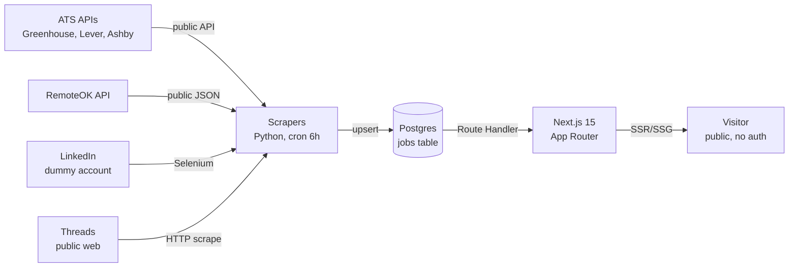

# 03 — System Architecture

| Field | Value |
|---|---|
| Version | 0.1 |
| Owner | Muhammad Fauzi Azhar |
| Status | Approved |

---

## 1. Overview

Job Aggregator is a **two-tier system**: a Python scraper layer that writes to Postgres, and a Next.js 15 frontend that reads from it. No real-time stream, no message queue, no microservices — a single Postgres + a single Next.js app + a handful of cron jobs is enough for MVP.

Core principles:

1. **Legal-first sources, risky sources last.** ATS public APIs first (Greenhouse/Lever/Ashby); LinkedIn with dummy account, accepts ban risk; Threads as bonus.
2. **Incremental > full.** Each cron tick only fetches jobs updated since last successful run. First run = full crawl, stored separately so retry is safe.
3. **One schema, many sources.** All sources normalized into a single `jobs` table; source attribution preserved via `source` column.
4. **Idempotent writes.** Upserts keyed by `(source, external_id)` — re-running a scraper is safe.
5. **No login, no cookies.** Frontend is fully public, scrapers do not need user state.

---

## 2. Context Diagram



---

## 3. Module Boundaries

```
job-aggregator/
├── scrapers/                  # Python 3.12
│   ├── common/                # shared: http client, normalizer, dedupe
│   ├── sources/
│   │   ├── greenhouse.py
│   │   ├── lever.py
│   │   ├── ashby.py
│   │   ├── remoteok.py
│   │   ├── linkedin.py        # uses py-linkedin-jobs-scraper
│   │   └── threads.py
│   ├── runner.py              # entrypoint, picks source via CLI arg
│   └── requirements.txt
├── src/                       # Next.js 15
│   ├── app/
│   │   ├── page.tsx           # landing
│   │   ├── jobs/page.tsx      # list + filter
│   │   ├── jobs/[id]/page.tsx # detail
│   │   └── api/
│   │       ├── jobs/route.ts
│   │       ├── sources/route.ts
│   │       └── stats/route.ts
│   ├── components/            # UI primitives + filters
│   ├── lib/
│   │   ├── db.ts              # Prisma client
│   │   ├── filters.ts         # filter parsing (URL <-> query)
│   │   └── normalize.ts       # shared normalizer (mirror scrapers/common)
│   └── types/
├── prisma/
│   └── schema.prisma
├── .github/workflows/
│   ├── scraper-cron.yml       # 6h cron, GH Actions
│   └── ci.yml                 # lint + typecheck + test + build
└── docs/
```

---

## 4. Data Flow

```
Cron tick (every 6h)
  ↓
[Per source] Check last_successful_run_at
  ↓
Fetch list (delta or full on first run)
  ↓
For each job: fetch detail if needed → normalize → upsert
  ↓
Mark jobs older than N days without update as expired (soft delete)
  ↓
Update scraper_runs table (status, counts, duration)
```

---

## 5. Key Decisions (see ADRs)

- [ADR-0001](./adr/0001-linkedin-scraping-strategy.md): LinkedIn scraping via dummy account, accept IP/session ban risk
- [ADR-0002](./adr/0002-threads-inclusion.md): Threads is signal-only (parse for "we're hiring" posts), not a primary source
- [ADR-0003](./adr/0003-storage-format.md): Postgres JSONB for raw payload, not separate per-source tables

---

## 6. Non-Functional

| Concern | Approach |
|---|---|
| Performance | Server-side pagination (cursor), Postgres indexes on `(source, posted_at)`, `(source, external_id)` unique |
| Cost | Postgres + Vercel free tier + GH Actions free tier fits MVP; budget $5-20/mo |
| Observability | Scraper runs logged to `scraper_runs` table; GH Actions artifacts on failure |
| Security | No auth = small attack surface; rate-limit public API at edge; no PII stored |
| Backups | Postgres managed backups (Vercel Postgres or Neon); daily snapshot |
