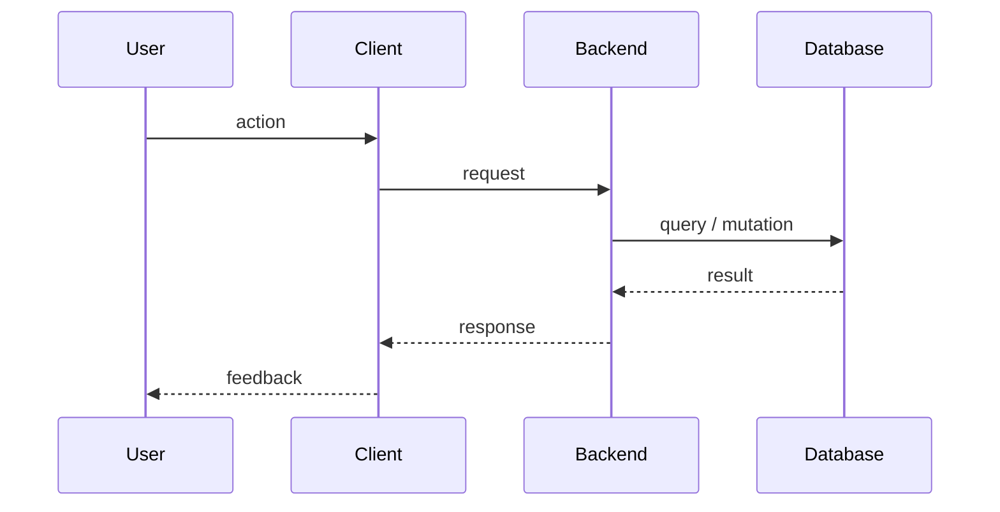

# 03 — System Architecture

| Field | Value |
|---|---|
| Version | 0.1 |
| Owner | Tech Lead |
| Status | Draft |

---

## 1. Overview

<!-- Two paragraphs max. What's the shape of the system, and what core principles drive the design?
Reference relevant ADRs in docs/adr/ for any decision that needed deliberation. -->

Core principles:

1.
2.
3.

---

## 2. Context Diagram

```mermaid
graph LR
  User1[End User]
  Admin[Admin]

  subgraph App[{{PRODUCT_NAME}} Client]
    UI[UI / Screens]
    State[State Management]
  end

  Backend[(Backend / API)]
  DB[(Database)]
  Storage[(Object Storage)]
  Ext[(External Service A)]

  User1 --> UI
  Admin --> UI
  UI <--> Backend
  Backend <--> DB
  App <--> Storage
  Backend --> Ext
```

> Distinguish **data-plane** (carries user content) from **control-plane** (signs URLs, mints tokens) connections in the prose under the diagram.

---

## 3. Client Structure

```text
{{REPO_NAME}}/
├── app/                    # Routes / screens
├── src/
│   ├── components/
│   ├── hooks/
│   ├── lib/
│   ├── services/           # API & external integrations
│   ├── stores/
│   ├── types/
│   └── tests/
├── assets/
└── docs/                   # ← this folder
```

Domain folders inside `src/services/` and `src/components/` mirror the domains in `02-technical-requirements.md` (e.g. `auth`, `<domain1>`, `<domain2>`, `admin`).

---

## 4. Backend Structure

<!-- Adapt for your stack: Supabase Edge Functions, Next API routes, FastAPI, NestJS, etc. -->

```text
{{PRIMARY_BACKEND}}/
├── migrations/             # SQL or framework migrations
├── functions/              # Server-side handlers
│   ├── <function-1>/
│   └── <function-2>/
├── tests/
└── seed/
```

---

## 5. Key Sequences

### 5.1 `<Critical journey 1 — e.g. user signs up + creates first record>`



### 5.2 `<Critical journey 2>`

---

## 6. Cross-Cutting Concerns

| Concern | Approach |
|---|---|
| Auth | |
| Authz | |
| Caching | |
| Realtime | |
| File upload | |
| Background jobs | |
| Email / notifications | |
| AI / LLM calls | When the AI add-on is enabled, LLM routing, agent loop guardrails, prompt versioning, and per-query cost caps live in dedicated docs. See `22-eval-methodology.md`, `23-prompts.md`, `24-agent-architecture.md`, `25-llm-cost-budget.md`, `26-validation-process.md`, `27-data-governance.md`. |

---

## 7. Environments

| Env | Purpose | Notes |
|---|---|---|
| local | Dev | Seeded data, mocked external services where reasonable |
| staging | QA, pilot users | Real external services, separate billing |
| production | Live | |

Detailed deploy: `11-devops-deployment.md`.

---

## 8. Decisions

Material architecture decisions are recorded as ADRs in `docs/adr/` and indexed in `18-decision-log.md`. When in doubt, write an ADR before merging.
