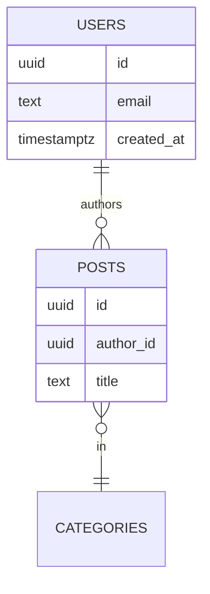

# 04 — Database Schema

| Field | Value |
|---|---|
| Version | 0.1 |
| Owner | Backend Engineer |
| Status | Draft |

---

## 1. Conventions

- Primary keys: `uuid` with `gen_random_uuid()` default unless otherwise stated.
- All tables include `created_at` and `updated_at timestamptz NOT NULL DEFAULT now()`.
- Soft delete = `deleted_at timestamptz` column. Hard delete only for ephemeral / cache tables.
- Names: `snake_case`, plural table names, singular column names.
- Foreign keys explicitly declared with `ON DELETE` / `ON UPDATE` behavior.
- Every public table has Row-Level Security enabled. Service-role bypass only inside server-side functions.

---

## 2. Enum Types

```sql
-- Example
-- CREATE TYPE user_role AS ENUM ('admin', 'member', 'guest');
```

---

## 3. Core Tables

### `<table_1>`

```sql
CREATE TABLE public.<table_1> (
  id uuid PRIMARY KEY DEFAULT gen_random_uuid(),
  -- ...
  created_at timestamptz NOT NULL DEFAULT now(),
  updated_at timestamptz NOT NULL DEFAULT now()
);
```

**Notes:**

-

### `<table_2>`

```sql
```

---

## 4. Relationship Diagram



---

## 5. Row-Level Security Policies

> Each policy must have positive AND negative tests in the RLS test suite. See `10-test-plan.md`.

```sql
-- Example pattern
-- ALTER TABLE public.<table> ENABLE ROW LEVEL SECURITY;
--
-- CREATE POLICY "Users read their own rows"
--   ON public.<table>
--   FOR SELECT
--   USING (auth.uid() = user_id);
```

| Table | Policy | Allows |
|---|---|---|
| | | |

---

## 6. Indexes

> Index decisions justified by access patterns in `05-api-specification.md` and known query plans.

```sql
-- CREATE INDEX <table>_<col>_idx ON public.<table> (<col>);
```

---

## 7. Migration Strategy

- Migrations are reviewed via PR; never edited after merge.
- Backfills that touch > 100k rows ship in a separate migration with batching + progress logging.
- Destructive changes (drop column, drop table) follow the **expand → migrate → contract** pattern across releases.
- Seed data lives in `seed/` and is environment-aware.

---

## 8. Backup & Retention

| Asset | Backup frequency | Retention |
|---|---|---|
| Database | | |
| Object storage | | |
| Audit logs | | |

Detailed DR plan: `19-observability-runbook.md`.
