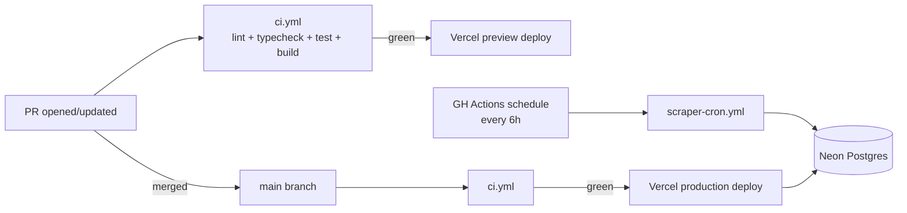

# 11 — DevOps & Deployment

---

## 1. Environments

| Env | URL pattern | Postgres | Deploy trigger |
|---|---|---|---|
| local | `http://localhost:3000` | Local Docker or shared dev DB | Manual |
| preview | `https://job-aggregator-<sha>.vercel.app` | Branch DB (Neon branch) | PR open / push |
| production | `https://jobagg.muhfauziazhar.com` | Neon prod | Merge to `main` |

---

## 2. CI/CD Diagram



---

## 3. GitHub Actions Workflows

### `ci.yml`

Triggers: PR open/update, push to main.

Jobs:
- `lint` — `eslint`, `prettier --check`
- `typecheck` — `tsc --noEmit`
- `test` — `vitest run` (unit + integration)
- `build` — `next build`
- `prisma-validate` — `prisma validate`

### `scraper-cron.yml`

Trigger: `schedule: cron: '0 */6 * * *'` (every 6h) + `workflow_dispatch`.

Jobs:
- Matrix over sources (`greenhouse`, `lever`, `ashby`, `remoteok`)
- `linkedin` and `threads` separate (less frequent, more fragile)
- Steps:
  1. Checkout
  2. Setup Python 3.12
  3. `pip install -r scrapers/requirements.txt`
  4. `python scrapers/runner.py --source ${{ matrix.source }} --mode incremental`
  5. Upload `scraper-runs` row (via psql or Prisma script)
  6. On failure: upload logs as artifact, create GH issue via `peter-evans/create-issue-from-file`

Secrets required:
- `DATABASE_URL`
- `LINKEDIN_EMAIL`
- `LINKEDIN_PASSWORD`
- (optional) `RESIDENTIAL_PROXY_URL` for LinkedIn rotation

---

## 4. Local Dev

```bash
# Postgres
docker run -d --name jobagg-pg -p 54321:5432 \
  -e POSTGRES_PASSWORD=dev \
  -e POSTGRES_DB=jobagg \
  postgres:16

# App
npm install
cp .env.example .env.local
npx prisma migrate dev
npm run dev

# Scraper (in another terminal)
cd scrapers
python -m venv .venv && source .venv/bin/activate
pip install -r requirements.txt
python runner.py --source greenhouse --mode full
```

---

## 5. Database Backups

- Neon: automatic point-in-time recovery, 7-day retention on free tier, 30-day on paid.
- Manual snapshot before schema migrations on prod.

---

## 6. Rollback

- Frontend: Vercel keeps last 10 deploys; rollback via `vercel rollback` or Vercel dashboard.
- Database: prefer forward migrations; destructive migrations gated by code review + staging dry-run.
- Scraper: idempotent — bad data overwrites itself next tick. Worst case: pause cron, restore from Neon snapshot.
