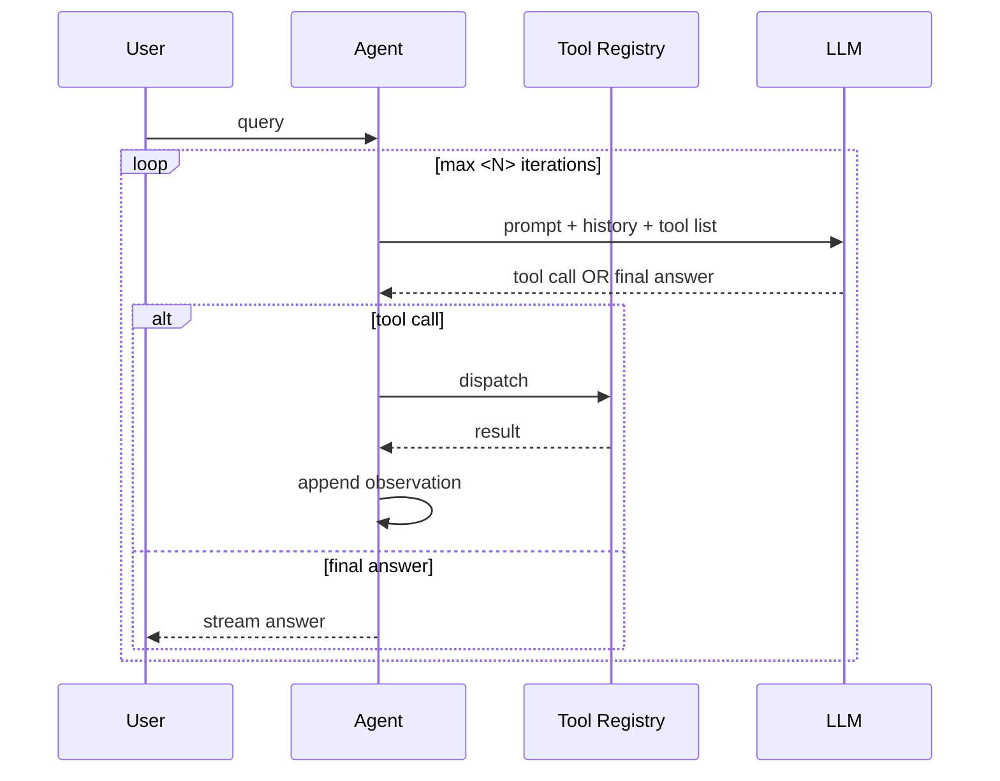

# 24 — Agent Architecture

| Field | Value |
|---|---|
| Version | 0.1 |
| Owner | AI Lead |
| Status | Draft |
| Add-on | AI |

> **AI add-on doc.** Skip this file for projects without an agent loop (single-shot LLM calls don't need this). Required when an LLM decides which tool to call, in what order, with what arguments.

---

## 1. Why this doc exists

`03-architecture.md` covers the system shape. This doc covers the **agent loop** — the part where an LLM holds the call stack and decides what to do next. Agent loops fail in ways traditional services don't: infinite tool calls, hallucinated tool arguments, hung iterations, runaway cost. This doc names every guardrail.

---

## 2. Loop Strategy

<!-- ReAct, native function-calling, plan-then-execute, multi-agent — pick one and explain why. -->

| Property | Value |
|---|---|
| Strategy | `<ReAct / native function-calling / plan-execute / multi-agent>` |
| Max iterations per query | `<8>` |
| Per-iteration timeout | `<30s>` |
| Total query timeout | `<60s>` |
| Streaming | `<yes / no>` |
| Memory between turns | See `27-data-governance.md` |

---

## 3. Tool Registry

<!-- Every tool the agent can call. Schema, side effects, cost, ownership. -->

| Tool ID | Purpose | Side effects | Cost class | Owner |
|---|---|---|---|---|
| `search_kb` | Hybrid retrieval over workspace | Read-only | Cheap | Retrieval Eng |
| `web_search` | External web search via `<provider>` | Read-only, external $ | Medium | Backend |
| `fetch_url` | Pull and parse a single URL | Read-only, external $ | Cheap | Backend |
| `calculate.<name>` | Run a domain calculator | Read-only | Cheap | Domain Eng |
| ... | ... | ... | ... | ... |

### 3.1 Tool description quality

Tool descriptions are prompts. They live in `src/prompts/tools/<name>.ts` and are versioned per `23-prompts.md`. A tool description must answer:

1. **What** does this tool do (one sentence)
2. **When** should the agent call it (positive examples)
3. **When** should the agent NOT call it (negative examples)
4. **What** arguments are required and what each means

---

## 4. Decision Logic

<!-- The rules the system prompt should bake in. Surfaces the contract between human and agent. -->

Examples:

- *Calculation question* → call the matching `calculate.*` tool, then explain
- *Methodology question* → call `search_kb`, then synthesize
- *Hybrid (calc + explain)* → `search_kb` for context, then `calculate.*`, then explain with citations
- *Out-of-scope* → respond with the canonical refusal message
- *Unclear question* → ask a single clarifying question, do not guess

---

## 5. Guardrails

| Failure mode | Mitigation |
|---|---|
| **Infinite loop** | Hard cap at `<N>` iterations, return partial result with notice |
| **Same tool called repeatedly with same args** | Detect via hash of (tool, args), reject second identical call in same query |
| **Hallucinated tool name** | Validate against registry before dispatch, return error to LLM |
| **Hallucinated args** | Validate via zod / pydantic schema before dispatch |
| **Tool timeout** | Kill at `<30s>`, return timeout result to LLM, let it decide retry |
| **Tool failure** | Return error to LLM as tool result; LLM can fall back or surface to user |
| **Runaway cost** | Per-query budget cap (tokens + tool dollars). Hard stop at `<$X>` |
| **PII / secret leak in args** | Pre-dispatch redaction layer for known patterns |

---

## 6. Observability

Every loop iteration emits a trace span. See `19-observability-runbook.md` for general observability and the trace shape below for agent specifics.

| Span | Attributes |
|---|---|
| `agent.query` | query_id, user_id, persona, total_iterations, total_cost, terminal_reason |
| `agent.iteration` | iteration_n, decision (`tool` \| `final`), latency_ms, prompt_tokens, completion_tokens |
| `agent.tool_call` | tool_id, args_hash, latency_ms, status, result_size |
| `agent.llm_call` | model, prompt_version, prompt_tokens, completion_tokens, cost_usd |

Tracing backend: see `26-llm-cost-budget.md` § Cost dashboard.

---

## 7. Eval Hooks

The agent records `expected_tools_used` and `actual_tools_used` per query for the `Tool Call Accuracy` metric in `22-eval-methodology.md`. These are written to the trace and the per-question eval log.

---

## 8. Open Questions

-
-
