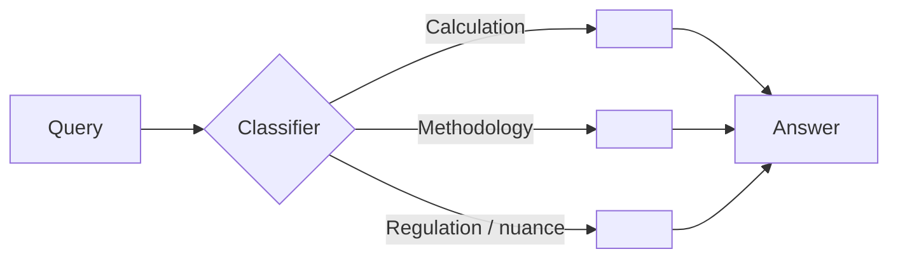

# 25 — LLM Cost & Budget

| Field | Value |
|---|---|
| Version | 0.1 |
| Owner | AI Lead + Finance |
| Status | Draft |
| Add-on | AI |

> **AI add-on doc.** Skip this file for projects without LLM features. `12-cost-budget.md` covers infrastructure and SaaS costs at the project level. This doc covers LLM-specific cost dynamics that need finer-grained tracking — per-query, per-feature, per-user — because they scale with usage, not headcount.

---

## 1. Why this doc exists

LLM cost behaves differently from server cost. Server costs scale with deploy size and stay flat per request; LLM costs scale linearly with traffic and prompt length, and can 10× overnight from a single retry-loop bug. A bad eval prompt can spend $50 in an afternoon. This doc names the budget guardrails before they're needed.

---

## 2. Cost Model

### 2.1 Token economics

| Model | Input $/1M | Output $/1M | Use case in this project |
|---|---:|---:|---|
| `<provider/model-name>` | `<$X>` | `<$Y>` | `<retrieval rerank / agent loop / final answer / fallback>` |
| ... | ... | ... | ... |

### 2.2 Per-query budget

| Component | Budget | Rationale |
|---|---|---|
| Embedding (query) | `<$0.0001>` | One call per query |
| Retrieval | `<$0>` | Vector DB self-hosted |
| Reranker | `<$0>` | Local model |
| Agent iterations × LLM | `<$0.003>` | Avg 3 iterations × ~1500 tokens |
| Tool execution | `<$0>` | Local code |
| Web search (if used) | `<$0.001>` | Per `<provider>` quota |
| **Per-query target** | **`<$0.005>`** | Hard cap |
| **Per-query absolute max** | **`<$0.020>`** | Trip circuit breaker above this |

### 2.3 Monthly budget envelope

| Bucket | Monthly cap | Owner |
|---|---|---|
| Production traffic | `<$X>` | Finance |
| Evaluation runs | `<$Y>` | AI Lead |
| Development / spikes | `<$Z>` | Tech Lead |
| **Total** | **`<$X+Y+Z>`** | |

---

## 3. Routing Strategy

<!-- Smaller and cheaper models for easy questions; large models reserved for hard ones. Document the rules. -->

| Trigger | Route to | Why |
|---|---|---|
| `<rule>` | `<model>` | `<reason>` |

Fallback chain when primary fails (timeout / 5xx):

1. `<primary>`
2. `<secondary>`
3. `<emergency model>` — last resort

---

## 4. Caching

| Cache | Hit rate target | TTL | Storage |
|---|---|---|---|
| Embedding (chunk) | `<99%>` | Until source revoked | Postgres |
| Embedding (query) | `<30%>` | 24 h | Redis |
| LLM response (deterministic queries) | `<10%>` | 1 h | Redis |
| Reranker output | `<50%>` | 24 h | In-memory |

---

## 5. Circuit Breakers

| Trigger | Action |
|---|---|
| Per-query cost exceeds `<$0.02>` | Abort, return partial result, log incident |
| Per-user daily cost exceeds `<$1>` | 429 with cooldown, alert if user is paid tier |
| Provider monthly spend exceeds `<80%>` of cap | Slack alert + on-call rotation |
| Provider monthly spend exceeds `<100%>` of cap | Hard stop on non-critical features (eval, dev), prod stays up |
| Provider 5xx rate > `<5%>` over 5 min | Auto-fail over to secondary model |

---

## 6. Cost Dashboard

| View | Source | Refresh |
|---|---|---|
| Per-query cost (live) | Langfuse trace | Real-time |
| Daily cost by feature | Langfuse aggregation | 1 h lag |
| Cost / user | Internal DB | Daily |
| Eval-run cost ledger | `eval/results/*/cost_breakdown.json` | Per run |
| Model performance vs cost | Eval harness | Per release |

Required panels on the AI cost dashboard:

1. Daily spend, last 30 days, by provider
2. Per-feature cost share
3. p50 / p95 / p99 cost per query
4. Top 10 most expensive queries (for pattern detection)
5. Cache hit rate per cache
6. Spend forecast vs monthly cap

---

## 7. Anti-patterns

- **No per-query budget.** A retry loop can burn through monthly cap in an hour.
- **No telemetry on cache hit rate.** Caching that isn't measured is caching that doesn't work.
- **All traffic to one model.** No routing means easy queries pay big-model prices.
- **Eval runs on the same key as prod.** A buggy eval can deplete prod budget.
- **Dollar amounts in code instead of env / config.** Pricing changes; deploys shouldn't.

---

## 8. Open Questions

-
-
