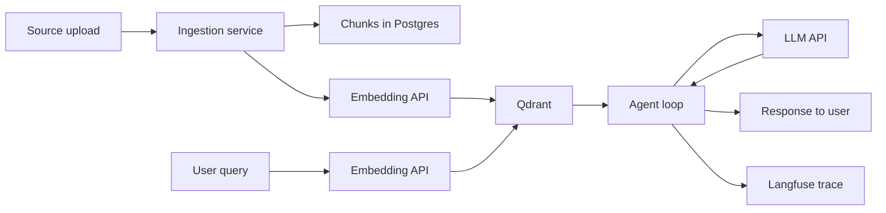

# 27 — Data Governance (AI add-on)

| Field | Value |
|---|---|
| Version | 0.1 |
| Owner | AI Lead + Tech Lead |
| Status | Draft |
| Add-on | AI |

> **AI add-on doc.** Skip this file for projects without LLM features. `13-security-compliance.md` covers project-level security and compliance. This doc covers AI-specific data flows: what goes into prompts and embeddings, what comes back from third-party LLM providers, and how that interacts with public showcase obligations.

---

## 1. Why this doc exists

When you call a hosted LLM, you ship data outside your trust boundary. When you embed and store text in a vector DB, you create a parallel copy of source content with different access controls than the original. When you build a portfolio project on top of expert-validated work, you have to separate what's safe to publish from what isn't. None of these are covered by traditional security docs because the data flow is unique to AI systems.

---

## 2. Data Flow Map

<!-- Every place text leaves the trust boundary or gets copied. -->

For each external arrow, list:

| Hop | Provider | What's sent | Retention by provider | Provider TOS link |
|---|---|---|---|---|
| Embedding API | `<openai>` | Source chunks (text) | `<0 days for paid API>` | `<link>` |
| LLM completion | `<openai>` | System prompt + user query + retrieved chunks | `<30 days for abuse review>` | `<link>` |
| Tracing | `<langfuse cloud>` | Full prompt + completion + metadata | `<by retention setting>` | `<link>` |

---

## 3. Data Classes

| Class | Examples in this project | Storage rules |
|---|---|---|
| **Public** | Public docs, regulations, public datasets, OSS papers | OK in repo, OK to embed, OK to send to LLM |
| **User-uploaded (consenting)** | Workspace files | Per-workspace namespace, encrypted at rest, never cross-workspace, opt-in to telemetry |
| **Confidential / partner** | Internal company data shared by expert | Local-only, never embedded to hosted vector DB, never sent to LLM in eval mode |
| **PII** | Names, emails, IDs in user data | Redacted before LLM call where feasible; isolated namespace; not in trace |
| **Secrets** | API keys, internal tokens | Never in prompts, never in traces, env-only |

---

## 4. Public Showcase Boundary

<!-- Critical for portfolio projects. Without this, a single careless commit can leak partner data. -->

| Artifact | Public OK? | Conditions |
|---|---|---|
| Source code | Yes | No hardcoded keys, no sample data with real PII |
| Architecture diagrams | Yes | Anonymize anything tied to a specific organization |
| Eval golden dataset | Conditional | Only if every Q&A is from public-domain sources or expert-authored with consent |
| Eval results aggregate | Yes | Roll-up numbers OK |
| Eval results per-question | Conditional | Only if the question came from public sources |
| Demo deployment data | No | Use synthetic / public-only data in the live demo |
| Validation sign-off docs | Yes | Redact sample text if it came from confidential source |
| Expert testimonial post | Yes | Reviewed and approved by expert before publishing |
| User logs from real workspace | No | Internal only, with TTL |

If unsure, the default is **don't publish**. A leak is harder to undo than a missed showcase opportunity.

---

## 5. PII Handling

| Path | Treatment |
|---|---|
| Inbound user query | No transformation; passed to retrieval and LLM as-is |
| Inbound document with PII | Detection layer flags, but no auto-redaction (false-positive risk too high) |
| Outbound LLM payload | Redaction of known patterns (emails, phone, IDs) before the call when feature flag `redact_pii_in_prompt=true` |
| Trace storage | PII stored only with `pii_consent=true` metadata; otherwise hashed |
| User data export | Available within `<X>` business days |
| User data deletion | Purges Postgres, Qdrant namespace, and trace records within `<X>` business days |

Detection patterns: see `src/lib/pii/patterns.ts` (or equivalent).

---

## 6. Provider TOS / Privacy Choices

<!-- For each LLM and tooling provider, document the data-handling settings actually in use. -->

| Provider | Setting | Value | Why |
|---|---|---|---|
| `<openai>` | API key project-level | `<dedicated AI project>` | Isolate from other projects |
| `<openai>` | Data sharing for training | `<off>` | TOS allows opt-out |
| `<langfuse>` | Trace retention | `<30 days>` | Balance debugging vs storage |
| `<provider>` | `<setting>` | `<value>` | `<why>` |

---

## 7. Consent & Disclosure

User-facing copy required at first chat / first source upload:

> "When you ask a question, your prompt and retrieved snippets are sent to <provider> for processing. <Provider> retains data for <retention> for abuse monitoring; we do not share data for model training."

Required disclosure points:

- [ ] On first source upload (per session)
- [ ] In privacy policy
- [ ] In `13-security-compliance.md`
- [ ] In README of public repo

---

## 8. Backup & Deletion

| Asset | Backup cadence | Retention | Deletion verifiable |
|---|---|---|---|
| Postgres (workspace, chats, eval) | `<daily>` | `<30 days>` | Yes — DB-level |
| Qdrant collections | `<daily>` | `<30 days>` | Yes — collection-level |
| Object storage (uploads) | `<replicated>` | Until user deletes | Yes — object-level |
| Langfuse traces | Provider-managed | `<as configured>` | Yes — provider API |

User deletion request flow: see `13-security-compliance.md` § Data subject rights.

---

## 9. Anti-patterns

- **One API key for all environments.** Eval, dev, and prod usage should be separable.
- **Trusting "we don't train on customer data" without checking the toggle.** Verify at the dashboard, not the marketing page.
- **Embedding everything by default.** Some confidential content shouldn't leave local. Add a per-source "embed yes/no" flag.
- **Mixing real-user data into the public eval set.** Even one paste from a private workspace contaminates the dataset.
- **No deletion path.** Build it before launch; retrofitting is harder than greenfield.

---

## 10. Open Questions

-
-
